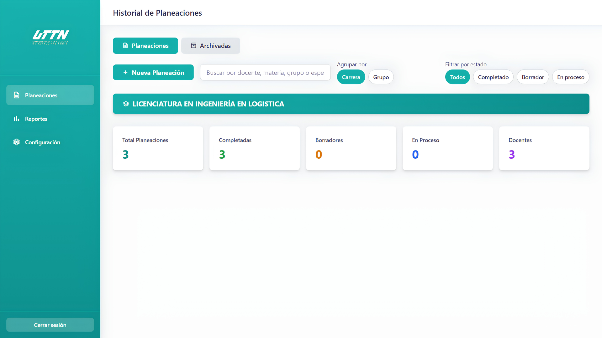

# Academic Planning Dashboard

<p>
  
  
  
  
  
</p>

Full-stack prototype for managing academic plans, reports and file uploads through a responsive dashboard.

The project explores how an academic planning workflow could be centralized in a web application. It currently includes a React frontend, an Express API, simulated authentication and in-memory data management.

<p align="center">
  
</p>

## Overview

Academic Planning Dashboard was designed to simplify the consultation and management of academic planning records.

Users can sign in to a simulated account, navigate through the dashboard and access planning history, reports and configuration sections.

The current version is a functional prototype. Database persistence, real authentication and OCR processing are planned improvements and are not yet implemented.

## Implemented features

### Frontend

- Simulated login screen
- Responsive dashboard layout
- Sidebar navigation
- Academic planning history
- Reports and statistics interface
- System configuration page
- File upload interface
- Reusable React components
- Responsive styling with Tailwind CSS

### Backend

- Express REST API
- Simulated session authentication
- Academic planning CRUD endpoints
- File upload endpoint
- Request error handling
- CORS configuration
- Protected prototype routes

## Technology stack

| Area | Technologies |
|---|---|
| Frontend | React 18, Vite, Tailwind CSS |
| Backend | Node.js, Express.js |
| Communication | Fetch API, REST |
| Development | JavaScript, npm, Git |

## Architecture

```text
academic-planning-dashboard/
├── src/
│   ├── components/
│   ├── pages/
│   ├── services/
│   ├── App.jsx
│   ├── main.jsx
│   └── index.css
├── server/
│   ├── controllers/
│   ├── middleware/
│   ├── routes/
│   ├── app.js
│   └── package.json
├── assets/
│   └── dashboard-preview.png
├── index.html
├── package.json
├── vite.config.js
├── tailwind.config.js
├── .env.example
└── README.md
````

## Getting started

### Requirements

Install the following software before running the project:

* Node.js
* npm
* Git

### Installation

Clone the repository:

```bash
git clone https://github.com/frannnkkyy/academic-planning-dashboard.git
```

Open the project:

```bash
cd academic-planning-dashboard
```

Install the frontend dependencies:

```bash
npm install
```

Install the backend dependencies:

```bash
cd server
npm install
cd ..
```

### Environment configuration

Create your local environment file from the example:

```bash
cp .env.example .env
```

Only add variables that are actually read by the project. Never commit `.env` or real credentials.

### Run the frontend

```bash
npm run dev
```

Frontend:

```text
http://localhost:5173
```

### Run the backend

Open another terminal:

```bash
cd server
npm run dev
```

API:

```text
http://localhost:3001
```

Health endpoint:

```text
http://localhost:3001/api/health
```

For more detailed installation instructions, read [QUICK_START.md](./QUICK_START.md).

## Local demo accounts

The following accounts are hard-coded for local demonstration purposes only:

| Role          | Username  | Password     |
| ------------- | --------- | ------------ |
| Administrator | `admin`   | `admin123`   |
| Teacher       | `docente` | `docente123` |

> These are not production credentials. Authentication is currently simulated and must not be used in a production environment.

## API endpoints

### Authentication

| Method | Endpoint           | Description               |
| ------ | ------------------ | ------------------------- |
| POST   | `/api/auth/login`  | Start a simulated session |
| POST   | `/api/auth/logout` | End the simulated session |

### Academic planning

| Method | Endpoint               | Description                   |
| ------ | ---------------------- | ----------------------------- |
| GET    | `/api/planning`        | Retrieve all planning records |
| GET    | `/api/planning/:id`    | Retrieve one planning record  |
| POST   | `/api/planning`        | Create a planning record      |
| PUT    | `/api/planning/:id`    | Update a planning record      |
| DELETE | `/api/planning/:id`    | Delete a planning record      |
| POST   | `/api/planning/upload` | Upload a planning file        |

## Current limitations

This repository represents a prototype and is not production-ready.

* Data is stored in memory and is lost when the server restarts
* Authentication uses simulated session tokens
* User passwords are not stored in a database
* OCR processing is not implemented
* Uploaded documents are not processed automatically
* Automated tests are not currently included
* Production deployment has not been configured

## Roadmap

* [ ] Add PostgreSQL or MySQL persistence
* [ ] Implement secure authentication with hashed passwords
* [ ] Add JWT validation and authorization
* [ ] Process documents with OCR
* [ ] Generate Excel reports
* [ ] Add input validation
* [ ] Add frontend and backend tests
* [ ] Document the API with Swagger/OpenAPI
* [ ] Create a Docker development environment
* [ ] Add a CI/CD workflow
* [ ] Deploy a public demonstration

## What I learned

This project helped me practice:

* Structuring a React application with reusable components
* Creating a responsive dashboard interface
* Connecting a frontend to an Express API
* Designing CRUD endpoints
* Handling loading and error states
* Separating frontend and backend responsibilities
* Documenting current limitations and future improvements

## Author

**Carlos Constantino**

* Portfolio: https://portafoliofrann.netlify.app/
* LinkedIn: https://www.linkedin.com/in/fcoocarlos/
* GitHub: https://github.com/frannnkkyy

## Project status

This project is under active development and is intended for learning and portfolio demonstration.

